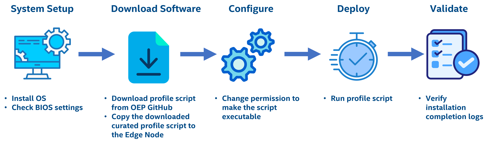
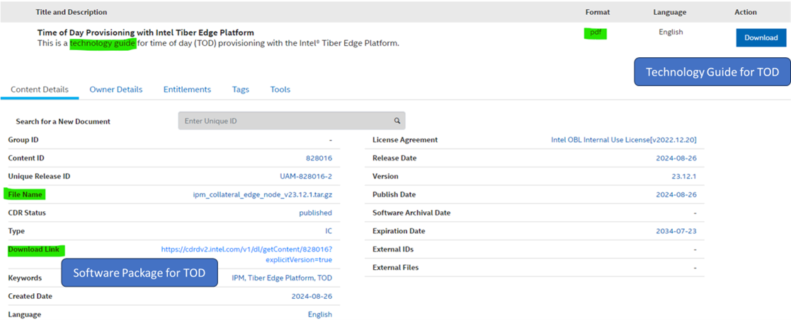

# Get Started

The installation flow for Intel Edge Device Enablement Framework – is primarily intended for Public / External users. The Edge Device Enablement Framework Software is installed through a shell script from OEP's edge-ai-libraries/frameworks folder. The user can download the installer script and deploy it to the Edge Node.


## Installation Process for Intel® EEF


*<center>Figure 1: Flow for Intel® Edge Device Enablement Framework</center>*

## Step 1: Prerequisites & System Set-UP

Before starting the Edge Node deployment, perform the following steps:-

- System bootable to a fresh Ubuntu 24.04 LTS Version.
- Internet connectivity is available on the Node
- The target node(s) hostname must be in lowercase, numerals, and hyphen’ – ‘. 
  - For example: wrk-8 is acceptable; wrk_8, WRK8, and Wrk^8 are not accepted as hostnames.
- Required proxy settings must be added to the /etc/environment file.
- Below are the BIOS settings to enable the secure boot.
   <details>
   <summary><code><b>BIOS Settings</b></code></summary>

   ### Please follow the below BIOS settings

   | **Settings** | **Process** |
   | ------------------------------------	|------------------------------------------------------------------------------------------------------------------ |
   | **Secure Boot** |  **Dell R760** :– <br> - BIOS Settings → System BIOS → System Security → Secure Boot → Enabled <br> **ASRock iEP-7020E, ASUS PE3000G** :– <br> - Press F2 → Go to UEFI Firmware Settings → Security Section → Secure Boot Section → Set Secure Boot Mode to Custom → Select Secure Boot → Enabled → Save Changes → Boot to setup. |
   </details>

## Step 2: Download the script

1. Click on Download here to get the downloadable link to the Intel® Edge device Enablement Framework script. <br>
<a href="https://raw.githubusercontent.com/open-edge-platform/edge-ai-libraries/main/frameworks/edgedevice-enablement-framework/base/va_enablement_node_profile/va_enablement_node_profile.sh" style="display: inline-block; padding: 10px 20px; font-size: 16px; font-weight: bold; color: white; background-color: #007bff; text-align: center; text-decoration: none; border-radius: 5px; border: none;">Download</a>

2. Download the file using wget.

   Example:
   ```
   wget https://raw.githubusercontent.com/open-edge-platform/edge-ai-libraries/main/frameworks/edgedevice-enablement-framework/base/va_enablement_node_profile/va_enablement_node_profile.sh 
   ```

## Step 3: Execution and Command-line options

- Modify the permissions of the installer file to make it executable.
   ```bash
   $ chmod +x va_enablement_node_profile.sh
   ```
- For ESQ and Metro use cases, additional command line parameters are not required.

   ```bash
   ./va_enablement_node_profile.sh
   ```
- Input parameters for TFCC and VPP RI use cases
   ```bash
   ./va_enablement_node_profile.sh tfcc
   ./va_enablement_node_profile.sh vpp
   ```
- Input parameter for vPRO platform Enablement
   ```bash
   ./va_enablement_node_profile.sh vpro
   ```
- Input parameter to configure the prerequisite tools for 'Magic-9' on the target edge node.
   ```bash
   ./va_enablement_node_profile.sh magic9
   ```
- Input parameters for DevKit set of component installation
   ```bash
   ./va_enablement_node_profile.sh devkit
   ```
- Execute it with --help/-h for checking the availability of any additional use case support
   ```bash
   ./va_enablement_node_profile.sh -h
   ``` 

> Please refer to below secure config details-

| **Agent/Component** | **Secure Config Detail** |
|---------------------|--------------------------|
| Prometheus | [prometheus config](https://prometheus.io/docs/prometheus/latest/configuration/configuration/) |


### User Inputs Required for the installer Execution

<details>
 <summary><code>User Input</code> <code><b>VA Enablement Node</b></code></summary>

#### Parameters:-

| Prompt                | User Input                                          |
|-----------------------|-----------------------------------------------------|
| Docker Group          | For Metro/ESQ team enter ‘yes’, other users enter 'no'   |
| DLStreamer            | Do you want to install DL Streamer? (y/n) <br> (Comes up only for DevKit Commandline arguement) |
| XPU-SMI     | Do you want to install Intel XPU-SMI ? (y/n) <br> (Comes up only for DevKit) |

</details>


## Step 4: Enabling of Time of Day (TOD)

Once the Installer script execution has completed, user can follow below steps to deploy Time of Day(TOD).

<details>
 <summary><code><b>Time of Day (TOD) Provisioning</b></code></summary>

The TOD allows power management provisioning to save power at a specific time of day and delivers power savings during non-peak hours on the Edge device using the Intel® Infrastructure Power Manager (IPM) . 
The user needs to download the [Time of Day Provisioning software package](https://www.intel.com/content/www/us/en/secure/content-details/828016/time-of-day-provisioning-with-intel-tiber-edge-platform.html?DocID=828016)  and the technology guide which is available through the same link as shown in the Figure. To deploy this feature, the user needs to follow the instructions mentioned in Chapter 9 of the TOD technology guide.


*<center>Figure 2: Time of Day Home Page</center>* <br>

 </details>

