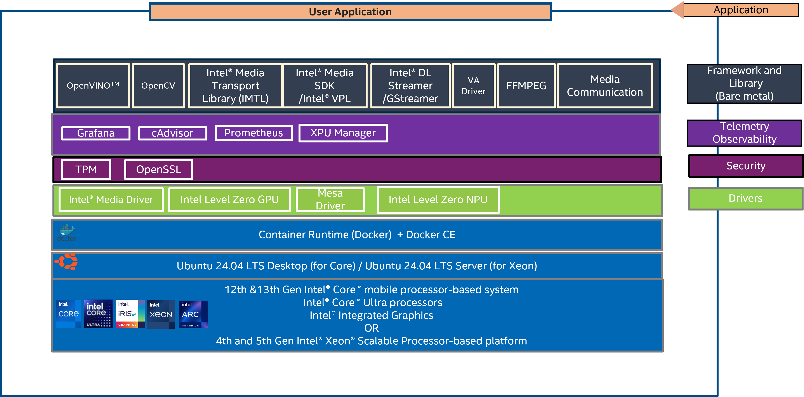

# Intel® Edge Device Enablement Framework (EEF)
Provides a set of curated, validated infrastructure Profiles for edge applications.

## Overview

**EEF Release - 25.12**

The Intel® Edge Device Enablement Framework (EEF) delivers a set of curated, validated infrastructure stacks (aka profiles), providing a runtime for edge applications. It is built on a modular framework where each node is based on a common foundation of hardware, OS, and container runtime.  

This document is a quick start guide to configure and deploy nodes using the Intel® Edge Device Enablement Framework on Intel® Core™ and Intel® Xeon® Scalable processors with Intel® Iris® Xe Integrated Graphics for Core platform.

## How It Works

This release of the Edge Device Enablement Framework currently contains the Video Analytics (VA) Enablement Node profile with the components curated for mainly the needs of Video Analytics (VA) workloads. Commandline options support the Metro, VPP, TFCC, vPRO, Magic9 enablement needs on the edge nodes and a new 'DevKit' option with a very minimal set of components and GPU/NPU driver installation.

## Main Supported Features

|**Category**                   |**Feature**               |
|-------------------------------|--------------------------|
|**Hardware**                   | - Support for 4th & 5th Gen Intel® Xeon® Scalable processor   - Support for Intel® Core™ Ultra processor and 12th & 13th Gen Intel® Core™ industrial processors   - Support for Intel® Iris® Xe Integrated Graphics for Core platform - Intel® Atom® Processor |
|**OS**                         | - Ubuntu 24.04.4 (Or the latest LTS version from Canonical ) |
|**CAAS**                       | - Model: Bare Metal   - ContainerD; Docker CE; Docker Compose |
|**Observability/Telemetry**    | - Aggregate/query telemetry (e.g. Prometheus)   - GPU, CPU/Memory Telemetry   - Visualization / Logs analysis |
|**Security**                   | - Secure Boot (documentation) (Enabled for SPR, RPL. Not supported on MTL internal SKUs)   - A hardware RoT-based foundation (TPM chip SW)   - Secure network & comm.  IPSEC, OpenSSL |
|**Framework**                  | -	OVPL; OpenVINO LTS; DLStreamer; GStreamer; Graph Compute Runtime; OpenCV with Ffmpeg; |

## Key Hardware Elements Supported  

|**Hardware Element**                                   | **Description**   |
|-------------------------------------------------------|---------------------------------------------------------------------------------------------------|
|**Processor**                                          | - 4th & 5th Gen Intel® Xeon® Scalable processors   - Intel® Core™ Ultra processors   - 12th & 13th Gen Intel® Core™ mobile processor-based server                                                                                                                                                  |
|**Supported – Reference Platforms & Commercial HW**   | - 4th & 5th Gen Intel® Xeon® Scalable processors on [Dell PowerEdge R760](https://www.dell.com/en-us/shop/servers-storage-and-networking/poweredge-r760-rack-server/spd/poweredge-r760/pe_r760_tm_vi_vp_sb)   - Intel® Core™ Ultra processors on Intel reference platform   - 12th Gen Intel® Core™ desktop processors on [ASUS PE3000G]()   13th Gen Intel® Core™ desktop processors on ASRock [iEP-7020E Series](https://www.asrockind.com/en-gb/iEP-7020E)   - Intel® Atom® Processor [iEP-5020G Series](https://www.asrockind.com/en-gb/iEP-5020G%20Series)                                         |
|**Network**                                            | - Intel Integrated i229   - Intel integrated i226   - Intel® X710 Ethernet Network Adapter   -Intel® E810 Ethernet Network Adapter |
|**GPU**                                                | - Intel® Iris® Xe Graphics (integrated with 13th Gen Intel® Core™ mobile processor)               |

## Key Software Capabilities Updates

| **Capability**                  | **Software Packages**        |
|---------------------------------|------------------------------|
| **Latest Software Support Summary** | - Prometheus 3.11.2   - Grafana 2.6.0   - cAdvisor v0.49.1   - Intel® XPU SMI v1.3.5   - OpenVINO 2025.4.0   - OpenCV 4.12.0   - FFmpeg 2025Q1   - oneVPL 25.4.5   - Intel® Media Driver 24.1.0   - Libva 2.22.0   - Mesa Driver 25.2   - Intel Level Zero for GPU 1.3.29735.27-914~22.04   - DiscreteTPM ubuntu-22.04   - OpenSSL 3.1.4   - Intel® LTS Kernel 6.6-intel   - Docker Compose 2.29   - DockerCE 27.2   - ContainerD 1.7.22   - GPU driver i915 v0.28.0 |

## Intel® Edge Device Enablement Framework Profile Architecture

*
Figure 1: Architecture of the Video Analytics (VA) Enablement Node Profile Intel® Edge Device Enablement Framework
*

## Hardware Bill of Materials (HBOM)

| Feature                  |Specification |
|--------------------------|----------------------------------------------------------------------------------------------------------------------|
| **Supported Target Platforms** | - 4th & 5th Gen Intel® Xeon® Scalable Processor-based server (Dell PowerEdge R760 BIOS version)   - 12th & 13th Gen Intel® Core™ mobile processor-based server (ASRock on iEP-7020E Series BIOS version)   - Intel® Core™ Ultra processors |
| **GPU**                  | - Intel® Iris® Xe Graphics (integrated with 13th Gen Intel® Core™ mobile processor) |
| **Storage**              | - Minimum: 128 GB   - Recommended: 256 GB |
| **Memory**               | - Core: 64 GB   - Xeon: 128 |
| **Ethernet Adapter**     | - Xeon:   o Intel® X710 Ethernet Network Adapter   o Intel® E810 Ethernet Network Adapter   - Core:   o Intel integrated i226 |

## Software Bill of Materials (SBOM)

| Feature                          | Component |
|-----------------------------------|---------------------------------------------------------------------------------------------------------------------------------------------------------------------|
| **Observability & Telemetry**    | - Platform-Observability - Prometheus - Grafana - cAdvisor - Intel® XPU Manager            |
| **Frameworks/ Test Suite**       | - OpenVINO™ Toolkit - DLStreamer - OpenCV |
| **Power Management**             | - Intel Power Management |
| **Libraries**                    | - FFmpeg - Intel® OneVPL - Intel® Media Driver - Libva - Lib Mesa Driver - Intel® Level Zero for GPU - GPU A780 - Intel® Media Transport Library (iMTL) - Media Communication Mesh (MCM) |
| **Security**                     | - TPM - OpenSSL |
| **Container Runtime**            | Container-D |
| **Virtualization**               | QEMU-KVM |

## Enabling of Time of Day (TOD) Provisioning

The Intel® Edge Device Enablement Framework offers the possibility to enable the feature Time of Day (TOD) provisioning. It is implemented with the Intel® Infrastructure Power Manager (IPM) technology. This software allows power management provisioning to save power at a specific time of day when Edge Node’s may be unused or underutilized.  This feature delivers power savings during non-peak hours for Edge services. You can install the feature on bare metal once you have completed the deployment of the Edge Node. To install the feature please follow the steps in [Step 4](Get-Started-Guide.md#step-4-enabling-of-time-of-day-tod)
