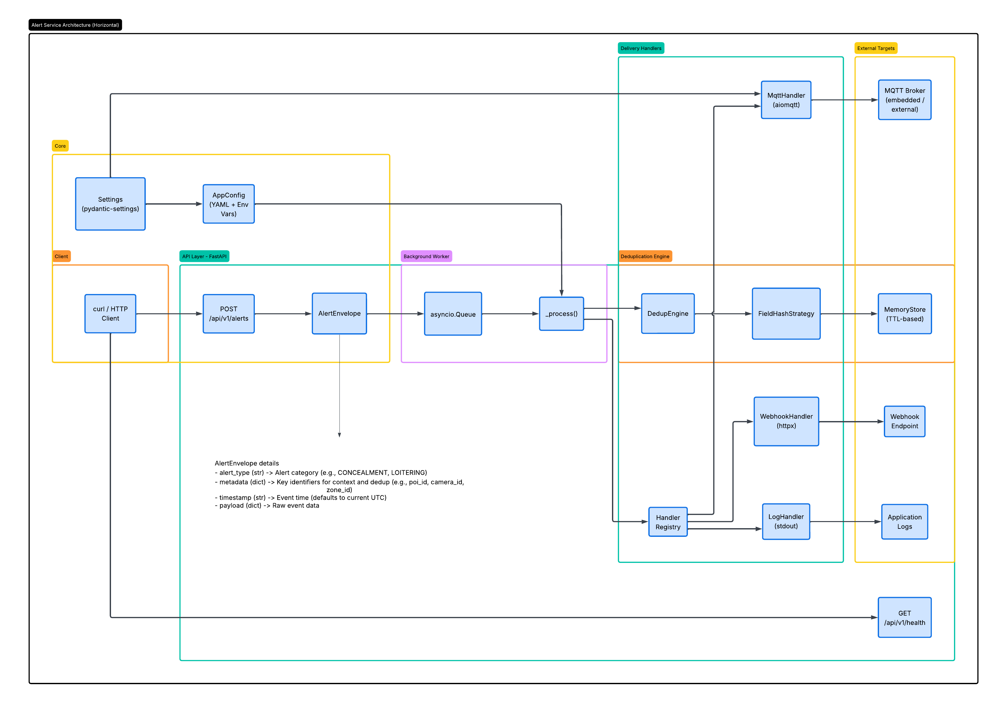

# Overview & Architecture

## Features

- **Flexible Ingestion** — `POST /api/v1/alerts` accepts any JSON payload
- **Deduplication** — In-memory, TTL-based field hash dedup with configurable strategy
- **Pluggable Delivery** — Webhook, MQTT, and Log handlers
- **Async Processing** — Background worker with `asyncio` queue
- **Retry** — Configurable retry attempts and interval for failed deliveries
- **Config-driven** — All subscriptions and routing defined in `config/config.yaml`

---

## High-Level Design



---

## Main Components

| Component | Module | Responsibility |
|---|---|---|
| **API Layer** | `src/api/` | FastAPI endpoints — accepts alerts, returns health status |
| **AlertEnvelope** | `src/core/models.py` | Normalized alert model — wraps raw JSON into typed fields (`alert_type`, `metadata`, `timestamp`, `payload`) |
| **AppConfig** | `src/core/config.py` | Loads YAML config, resolves `${ENV_VAR}` placeholders, applies `DELIVERY_HANDLERS` override |
| **Settings** | `src/core/settings.py` | Pydantic-settings model — loads env vars / `.env` file; `mqtt_broker` property resolves embedded vs external |
| **AlertWorker** | `src/worker.py` | Background async loop — dequeues alerts, runs dedup, dispatches to delivery handlers with retry |
| **DedupEngine** | `src/dedup/engine.py` | Orchestrator — delegates to strategy + store to determine if an alert is a duplicate |
| **FieldHashStrategy** | `src/dedup/strategy.py` | Extracts configured fields via dot-notation, hashes them (SHA-1/MD5), returns a dedup key |
| **MemoryStore** | `src/dedup/store.py` | In-memory TTL store — `set(key, ttl)` / `exists(key)` with automatic expiry via `time.monotonic()` |
| **Handler Registry** | `src/delivery/registry.py` | Maps type strings (`log`, `mqtt`, `webhook`) to handler class instances |

---

## Delivery Handlers (Actors)

The three pluggable handlers implement the abstract `DeliveryHandler` interface (`async deliver(envelope, target)`):

| Handler | Transport | Key Behaviour |
|---|---|---|
| **LogHandler** | `stdout` | Writes `ALERT DELIVERED [type]: metadata=... timestamp=...` to application log |
| **MqttHandler** | MQTT (TCP/WS) | Publishes JSON payload to a topic via `aiomqtt`. Broker resolved from `MQTT_MODE` (embedded → compose service `mqtt`, external → `MQTT_HOST`). Supports optional auth. |
| **WebhookHandler** | HTTP POST | Sends JSON payload to `target.url` using a shared `httpx.AsyncClient` (10 s timeout). Raises on non-2xx status. |

---

## Worker Loop & Retry

- The worker runs a **non-blocking async loop** with a 1 s dequeue timeout so it can respond to shutdown signals promptly.
- Each delivery target is retried **independently** — failure in one handler does not block others.
- Retry is configurable via `config.yaml` (`retry_attempts` default 3, `retry_interval_seconds` default 5).
- Unhandled exceptions are logged and the loop continues processing the next alert.

---

## MQTT Mode

| Mode | `MQTT_MODE` | Broker | Compose Behaviour |
|---|---|---|---|
| **Embedded** | `embedded` | `mqtt` (compose service) | `make up` starts Mosquitto alongside alert-service |
| **External** | `external` | `MQTT_HOST` env var | `make up` starts only alert-service |

---

## Config Pipeline

```
.env / environment variables
        ↓
    Settings (pydantic-settings)
        ↓
    load_config(CONFIG_PATH)
        ↓
    config.yaml → YAML parse → ${VAR} resolution
        ↓
    DELIVERY_HANDLERS override? ──yes──→ replace all delivery lists
        │ no
        ↓
    AppConfig (service + subscriptions)
```

---

## Project Structure

```
alert-service/
├── src/
│   ├── __init__.py
│   ├── main.py                  # FastAPI app entry point
│   ├── worker.py                # Async background worker
│   ├── api/
│   │   ├── router.py            # API router
│   │   └── endpoints/
│   │       ├── alerts.py        # POST /alerts
│   │       └── health.py        # GET /health
│   ├── core/
│   │   ├── config.py            # YAML config loader
│   │   ├── models.py            # AlertEnvelope model
│   │   └── settings.py          # Environment settings
│   ├── dedup/
│   │   ├── engine.py            # Dedup orchestrator
│   │   ├── store.py             # In-memory TTL store
│   │   └── strategy.py          # Field hash strategy
│   └── delivery/
│       ├── base.py              # Abstract handler
│       ├── log.py               # Log handler
│       ├── mqtt.py              # MQTT handler
│       ├── webhook.py           # Webhook handler
│       └── registry.py          # Handler registry
├── config/
│   └── config.yaml              # Subscription config
├── docs/
│   ├── alert-service-architecture.png
│   ├── overview-and-architecture.md
│   ├── get-started.md
│   └── configure.md
├── mosquitto/
│   └── config/
│       └── mosquitto.conf       # Broker config (ports 1883 + 9001)
├── tests/
│   ├── __init__.py
│   ├── conftest.py
│   ├── test_api.py
│   ├── test_config.py
│   ├── test_dedup.py
│   ├── test_delivery.py
│   ├── test_models.py
│   ├── test_worker.py
│   └── ws_subscriber.py         # MQTT-over-WebSocket test client
├── .env.example                   # Environment template
├── docker/
│   ├── Dockerfile
│   └── docker-compose.yml
├── Makefile
├── pyproject.toml
├── requirements.txt
└── README.md
```

---

**Next:** [Getting Started](get-started.md) · [Configuration & Customization](configure.md)
