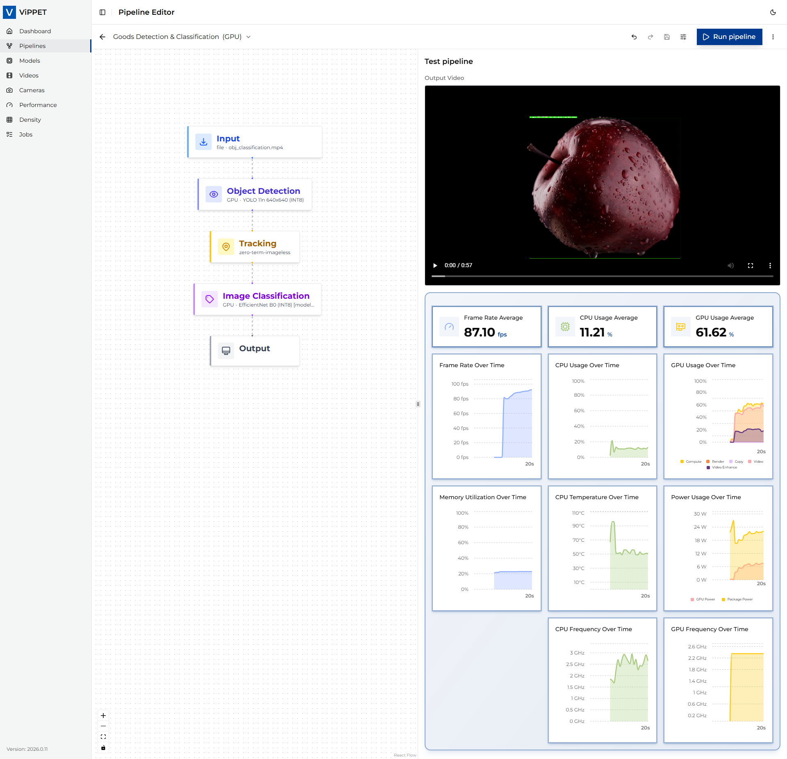

# Configure Pipeline

This article explains step-by-step how to configure and test AI pipelines using ViPPET's Pipeline Builder,
from creating a new pipeline using DLStreamer launch string, editing the pipeline elements, to demonstrating
running pipelines on both CPU and GPU to compare performance.

## Add new pipeline

First, you need to add a new pipeline. To do this, click on *Add New Pipeline* button and provide the following
information:

- *Name* - Unique name for the pipeline
- *Description* - Pipeline's high-level description
- *Pipeline Description* - DLStreamer launch string

Once you provide this information, click the *Add* button. Once the pipeline description is validated, the pipeline
is shown as a graph in the Pipeline Builder view.

> **Note:** To view the output video or live stream in ViPPET, your pipeline must include a `fakesink` element with
> the `name=default_output_sink` property. This serves as a placeholder that ViPPET automatically replaces with the
> appropriate output configuration when you run the pipeline. For example: `... ! gvawatermark ! fakesink name=default_output_sink`.

## Edit pipeline parameters

In the Pipeline Builder, you can view and configure the elements of the pipeline. For example, you can change
the *model* and *device* parameters in GVADetect and GVAClassify elements.

\
*Edit pipeline parameters*

## Run pipeline on CPU

You can run the pipeline and save the output video using CPU-based encoding. Once the pipeline starts,
CPU utilization should visibly increase. The generated output video is then available for inspection.

## Run pipeline on GPU

You can run the pipeline on a GPU to evaluate potential performance improvements. This requires updating the device
settings in the detection and classification components. After configuring the pipeline, you execute it and record
the output. During execution, GPU utilization should visibly increase.

With output saving enabled, the pipeline might not achieve maximum performance. You can then rerun the pipeline
with output saving disabled to measure the impact of I/O overhead.

\
*Check CPU and GPU performance*
