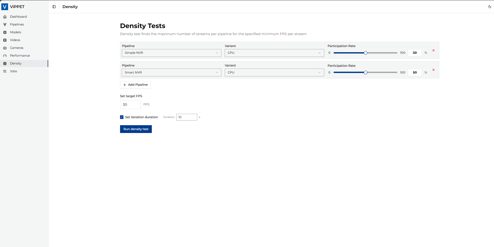
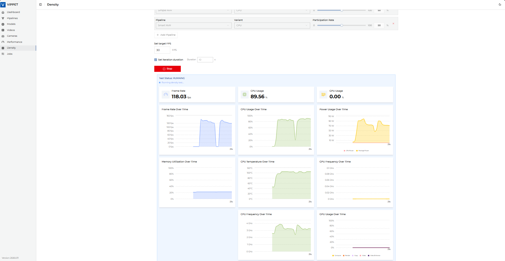
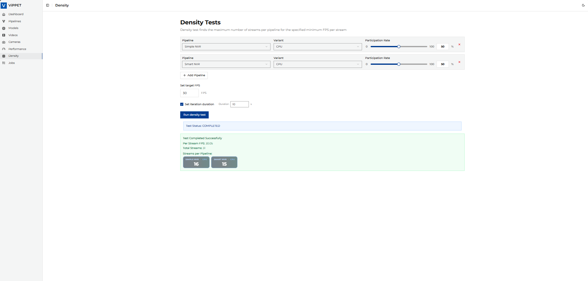

# How to Test Density

This article explains how to run density tests in ViPPET and interpret the results.
A density test finds the maximum number of streams that can run while keeping the target
minimum FPS per stream. Compared to a standard performance test (fixed stream count),
density testing increases the load and searches for the highest stable stream count that
still meets your FPS requirement.
Therefore, it answers the question: `How many concurrent streams can this platform sustain
at my required FPS floor?`

## Density Testing Algorithm

The density testing algorithm is designed to find the maximum number of concurrent video
streams that can be processed while maintaining a minimum performance threshold (FPS floor).
The algorithm uses a two-phase approach:

### Phase 1: Exponential Growth

- Start with 1 stream and run the pipeline.
- Double the stream count after each successful run that meets the FPS threshold.
- Continue exponentially (`1 -> 2 -> 4 -> 8 -> 16...`) until the per-stream FPS drops below the specified `fps_floor`.
- Track the best configuration that still meets the performance requirements.

### Phase 2: Binary Search Refinement

- Switch to binary search once performance drops below the threshold.
- Set bounds:
  - Lower bound = last successful stream count (`N/2`).
  - Upper bound = current failing stream count (`N`).
- Bisect the range and test the midpoint.
- Adjust bounds based on results:
  - If `FPS >= threshold`: update best config, move lower bound up.
  - If `FPS < threshold`: move upper bound down.
- Continue until bounds converge.

### Stream Distribution

- Multiple pipelines can be tested simultaneously.
- Stream allocation is proportional based on `stream_rate` ratios (must sum to `100%`).
- Rounding handling: the last pipeline gets remaining streams to account for rounding errors.

### Algorithm result

The algorithm returns the optimal configuration with:

- Maximum number of streams that meet the FPS requirement.
- Distribution of streams across pipelines.
- Achieved per-stream FPS.
- Output file paths for video results.

## Running density testing

Density testing helps you find the maximum number of concurrent streams that still
meet a required FPS floor.

### Configuration

Before running the test, configure the workload in the **Density** tab:

1. Open **Density** tab.
2. Set **FPS Floor** (for example, `30`).
3. Add one or more pipelines.
4. For each pipeline, set **Stream Rate** so all pipelines sum to `100%`.
5. Set **iteration duration** in seconds (for example, `30`).

What is happening:

- **stream_rate** defines proportional stream allocation across selected pipelines.
- ViPPET uses these ratios to distribute total streams during each test iteration.

*Figure 1: Density test configuration view*

### Running

After configuration, click **Run density test**.

What is happening:

- ViPPET starts with a small stream count and increases load (exponential growth).
- When FPS drops below `fps_floor`, ViPPET refines the maximum sustainable stream
  count using binary search.
- The process ends when the algorithm converges on the best stable configuration.

*Figure 2: Density test in progress*

### Test results

When the job completes, ViPPET reports:

- Per stream FPS
- Total streams
- Stream distribution per pipeline

*Figure 3: Density test results summary*

### Stream rate rules

`stream_rate` defines how total streams are distributed among selected pipelines.

Example:

- Pipeline A: `60`
- Pipeline B: `40`
- Total: `100` (valid)

### Result interpretation

Use density results together with performance metrics:

- Higher **total streams** at the same FPS floor indicates better density.
- **Per-stream FPS** should stay at or above the configured floor.
- For stable comparison between platforms, keep the same FPS floor, input data, and pipeline configuration.
- Compare results across devices using the same test profile.
