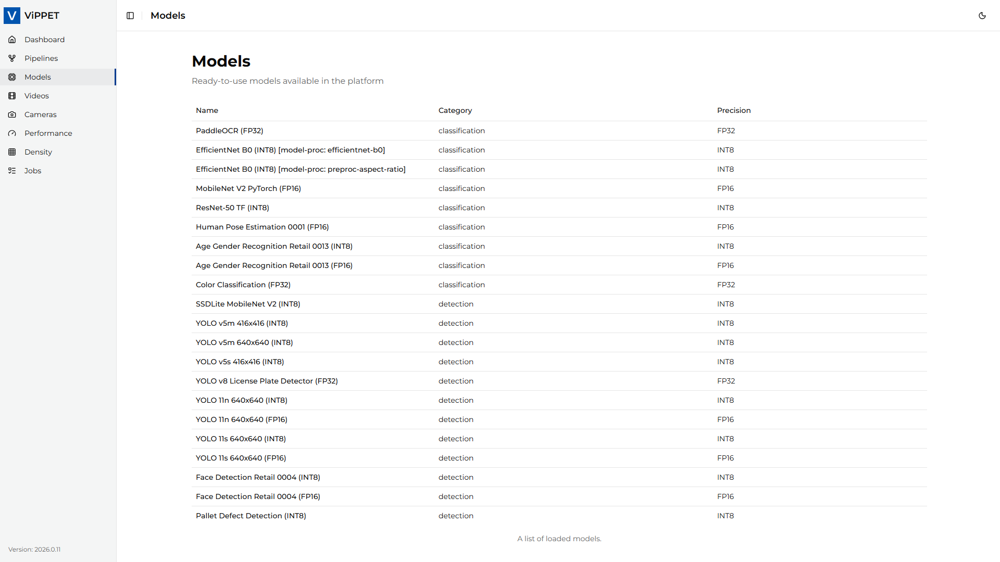
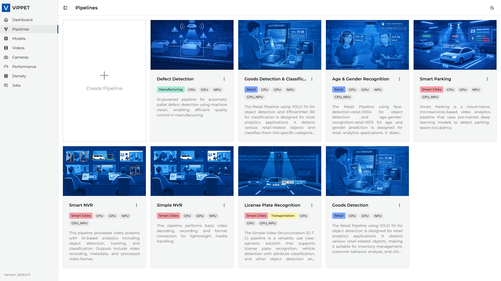
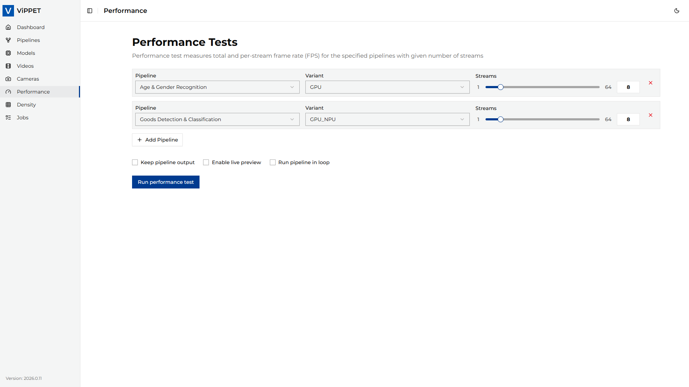
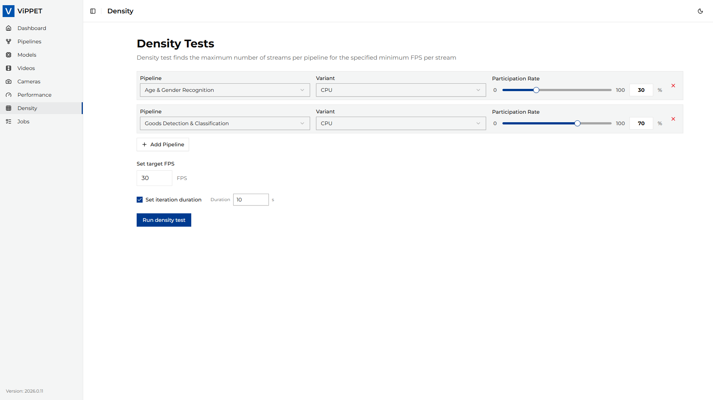
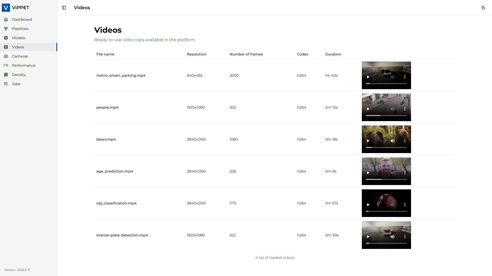
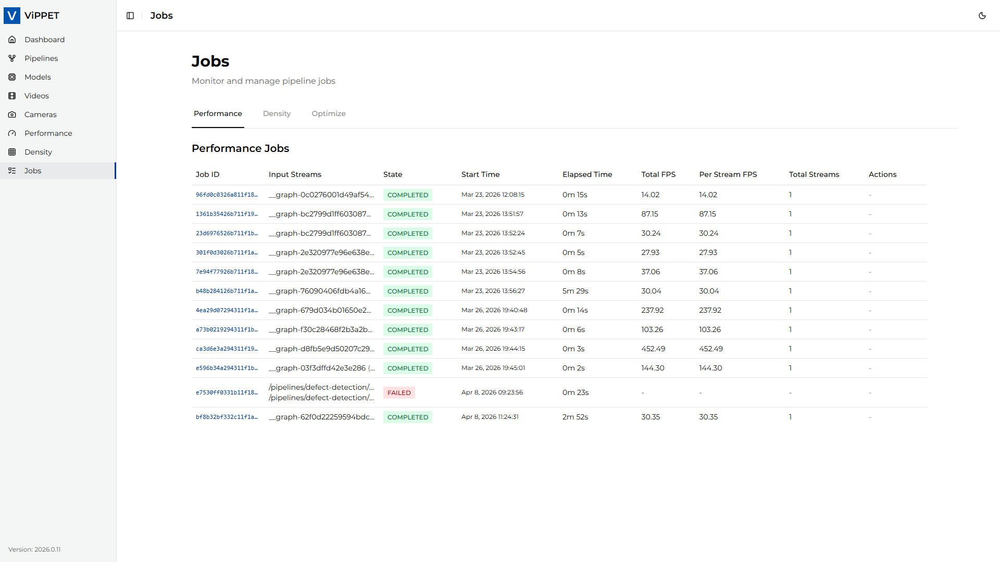
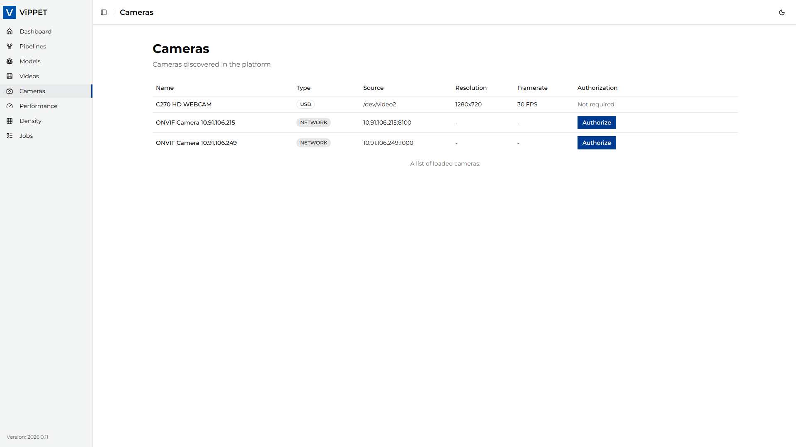

# How To Use ViPPET

This page maps ViPPET UI sections to dedicated how-to articles.

## Dashboard

Use the dashboard section to monitor current system and test activity from a single view.
It provides a quick health snapshot before and during test execution.

Related article:

- [Get Started](./get-started.md)
- [Troubleshooting](./troubleshooting.md)

## Models

*Figure 1: Models section in ViPPET UI*

Use this section to review and manage AI models used by your pipelines.
It helps keep model assets organized and ready for pipeline configuration.

## Pipelines

*Figure 2: Pipelines section in ViPPET UI*

Use this section to create, edit, and validate pipeline definitions.
You can also adjust element parameters and prepare variants for testing.

Related article:

- [Configure Pipeline](./how-to-guides/configure-pipelines.md)
- [How To Use Gvapython Scripts](./how-to-guides/use-gvapython-scripts.md)

## Performance

*Figure 3: Performance section in ViPPET UI*

Use this section to run fixed-stream performance benchmarks.
It supports both single-pipeline and multi-pipeline concurrent testing.

Related article:

- [Test Performance](./how-to-guides/performance-testing.md)

## Density

*Figure 4: Density section in ViPPET UI*

Use this section to find the maximum sustainable stream count for a target FPS floor.
It is best suited for platform capacity planning and stream scaling decisions.

Related article:

- [Test Density](./how-to-guides/density-testing.md)

## Videos

*Figure 5: Videos section in ViPPET UI*

Use this section to review outputs generated by tests and pipelines.
It helps validate visual quality.

Related article:

- [Use Video Generator](./how-to-guides/use-video-generator.md)

## Jobs

*Figure 6: Jobs section in ViPPET UI*

Use this section to track running and completed tasks.
You can quickly verify status, timing, and completion history.

## Cameras

*Figure 7: Cameras section in ViPPET UI*

Use this section to manage camera-like inputs used by tests and pipelines.

Related article:

- [How To Use Cameras](./how-to-guides/use-cameras.md)

<!--hide_directive
:::{toctree}
:maxdepth: 2
:hidden:

./how-to-guides/configure-pipelines
./how-to-guides/performance-testing
./how-to-guides/density-testing.md
./how-to-guides/use-cameras
./how-to-guides/use-video-generator
./how-to-guides/use-gvapython-scripts

:::
hide_directive-->